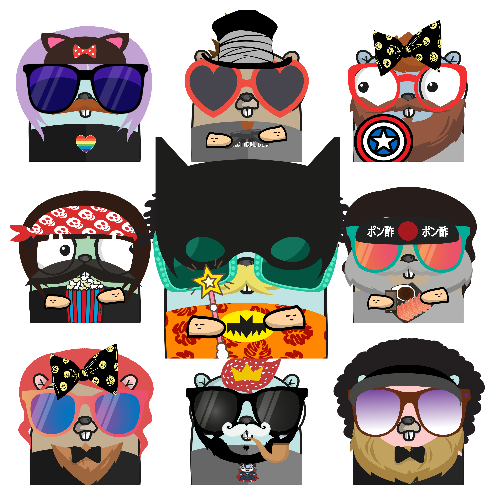
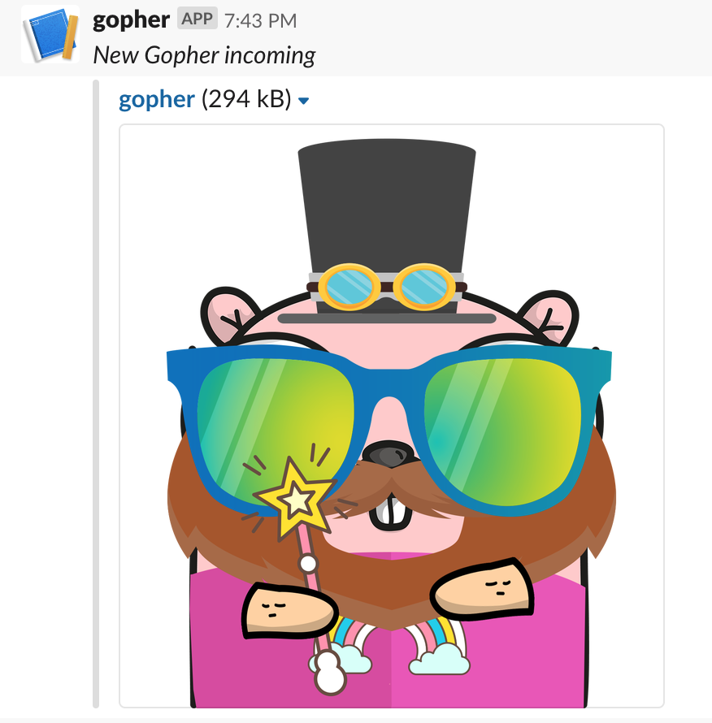

# gopherize-random 

#### a webserver that generates a random Go gopher everytime

- 


-  GET `/random-gopher`
	- Generates a new image of a gopher and redirects you to that image 
- GET `/random-gopher?format=json`
	- Generates a new image of a gopher and returns the link to the image in a json response. The response will be in this format
		```
		{
			"img" : "linktoimage.png"
		}
		```
- POST `/random-gopher`
- This endpoint exists if you would like to use this as a slack slash command. https://api.slack.com/slash-commands
    - 
